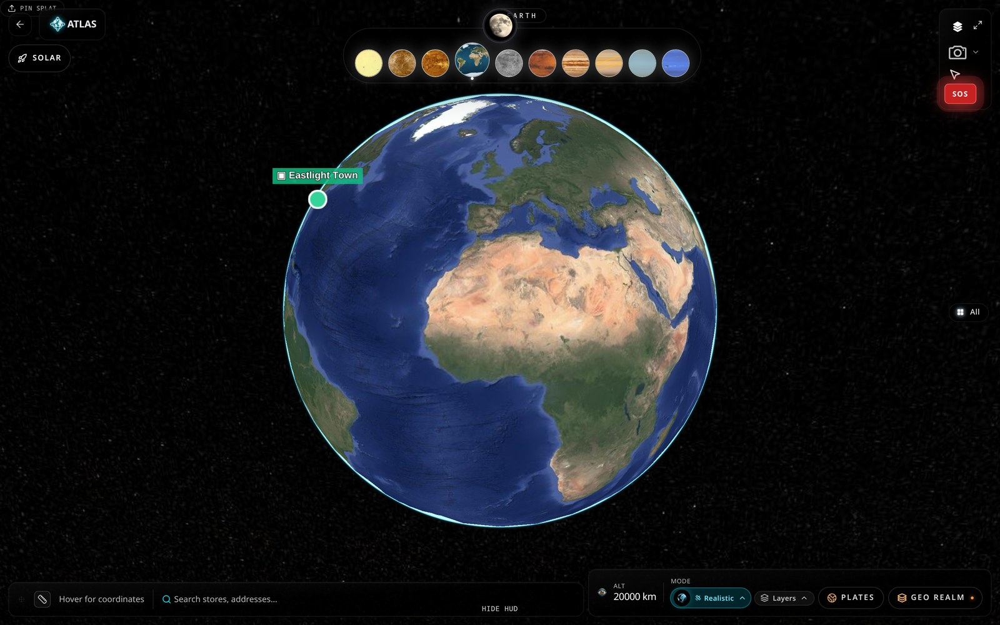

# ATLAS — Global Command Center



By [Imagine Engine Studios Corp](https://www.imagineengine.space)

ATLAS is a real-time 3D command center for supply, demand, delivery and disaster
response. It combines a photoreal planetary globe, tectonic and geophysical data,
live hazard feeds and an operations dashboard in a single workbench.

## Highlights

- **Atlas** — CesiumJS globe with realistic imagery, solar-system navigation, POIs,
  routing, logistics tracking and tile intelligence.
- **Geo Realm** — volumetric tectonic plates (NNR-MORVEL 2010 Euler poles), PB2002
  boundaries, CRUST1.0 layer stack, Slab2 subduction geometry, seismic sections and
  tomography indicators.
- **HOT** — live hazard feed aggregating USGS, NASA EONET, GDACS, ReliefWeb and
  NOAA/NWS, with warning broadcasts and push notifications.
- **Alerts** — email and SMS warning system with a 100+ language hazard keyword
  dictionary and proximity-based broadcasting.
- **Levels** — 3D scene design tools with splines, face painting, lighting and
  snap-to-grid.

## Tech stack

React 18 · Vite · TypeScript · Tailwind CSS · CesiumJS · React Three Fiber ·
Supabase (Postgres, Auth, Storage, Edge Functions)

## Getting started

```bash
bun install
bun run dev
```

The app runs at `http://localhost:8080`.

## Build

```bash
bun run build
```

## License

Released under the [MIT License](LICENSE) — Copyright (c) 2026 Imagine Engine Studios Corp.
